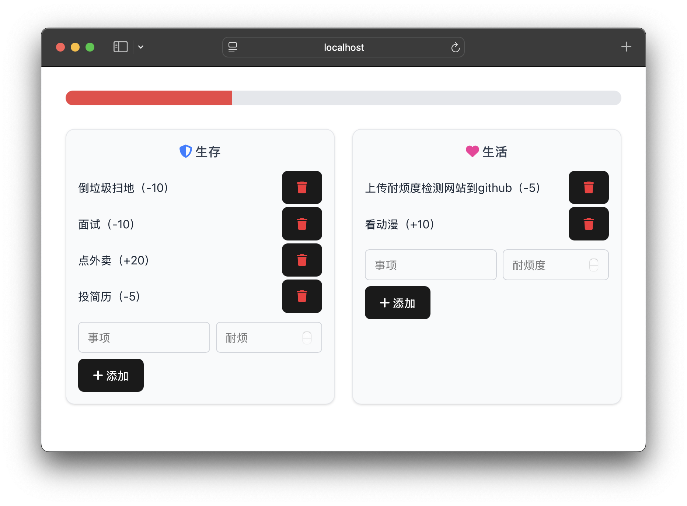

# 耐烦度计算（我操这个b世界）

在线预览：https://impatient-8wa4jvkts-pinouts-projects.vercel.app

⼈的⼼脏深处，有⼀种最本源的能量，叫做“**耐烦**”

它约婴⼉拳头⼤⼩，被⼀层薄薄的⾁膜包裹着，随着⾎液循环，⼼脏⿎动，为⾁身源源不断输送能量

你每天睁眼起来，万事万物，都需要**耐烦**。

穿⾐，吃饭，冲⻢桶，系鞋带，地铁刷卡，填⽇报，开会，应付客户与上级，进⻔，脱⾐，洗澡，拉屎……

**耐烦值**强的⼈，可以周六早上七⼋点就起来，收拾房间，打扫卫⽣，买菜，坐⼀桌好饭，下午学习刷题考证，傍晚

健身，晚上和朋友社交聚会，深夜回来听⼀会⼉英语，洗澡，写⽇记，睡觉。

他们⼀边⼯作，⼀边⾃我提升，⼀边社交，⼀边恋爱，⼀边有⾃⼰的兴趣爱好，⼀边旅游打卡……

那么⾃杀的⼈，是怎么回事呢？

除了少部分舍⽣取义⾃杀

⼤部分⾃杀者，都是因为耐烦⽤光了，耗尽了。

或许是因为连续不断的失败，⼜或许是特别巨⼤急促的打击，⼜或许是周身环境的四⾯⼑割。

⼼脏深处那股耐烦，被磨光了，只剩下空空的⼀层⽪耷拉着，整个委顿下来。

简称，累了，这个b世界。

从不想吃饭开始，味觉退化，五味失调，吃什么都⼀样，饿到极限之后，两⼝就饱。

然后不想洗澡，不想换⾐服，提不起劲，浑身发臭，发酸，发软，只想躺着。

然后不想⻅⼈，不想处理任何事，不想费⼀点⼼。

胸⼝处呼⽓多，进⽓少，疲乏⽆⼒到了极致。

整个⼈仿佛⼀颗厚实的桃⼦，外表和中层的果⾁，厚如雾⽓，由疲乏厌倦乏⼒组成。

中间⼀颗极为细⼩，如针⼀般的果核，是尖锐锋利的伤痛，失望，不⽢，悔恨，憎恨，悲凉。

不挖到深处，只会看⻅莫名其妙的⾃毁，皱巴巴糊⾥糊涂的死亡

为什么有些⼈的⾃杀在我们看来是莫名其妙但，懦弱的，⼀⽆是处的？

⽐⽅说，被导师逼死的研究⽣，被爆⾦币的跳河⻳男，被性侵后⾃缢的少⼥。我们总觉得，你煞笔啊，你有能耐⾃杀，你把仇⼈也带⾛啊，踏⻢的读书读傻了。

但其实，他只是，在那⼀瞬间**耐烦**被耗尽了。

够了，算了，算了，算了，算了，不玩啦，没意思了，⼜能怎么样呢，算了，死了算了。

这是四⾯⼋⽅的挤压与抽吸，以及⾃⼰内⼼的负向认知发展到了极致。

不想了，不要了，够了，⼀秒钟也待不下去了，什么报仇不报仇的，真的好累啊。

就仿佛是因为耐烦耗尽，身体代谢异常，催⽣了⼤量的有害毒素，致使有机体⽆法忍受，基因催促着搞快结束⽣命

所以啊，保护好⾃⼰⼼脏深处的“耐烦”

当它灭的差不多时，你也就离抑郁症差不多，当它彻底熄灭，你便随时可能会死。
